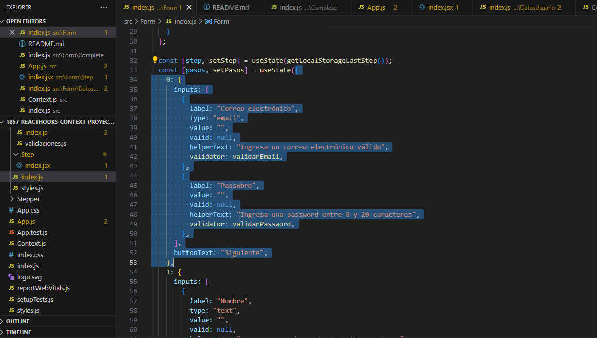
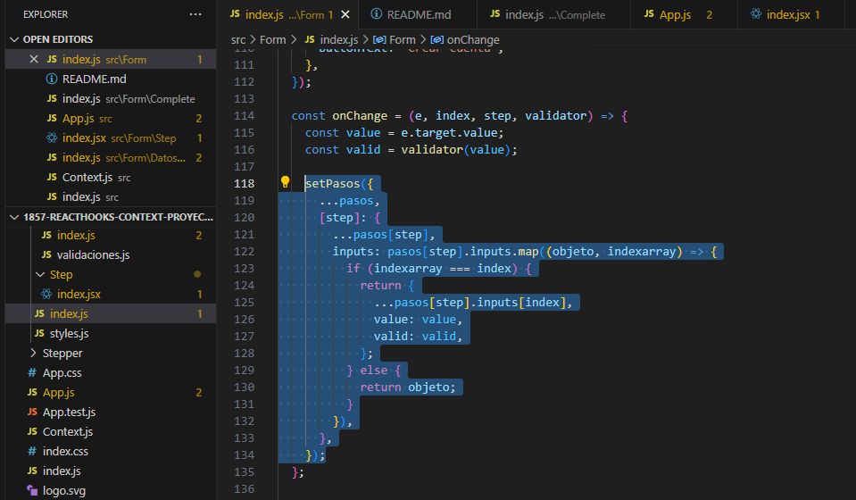
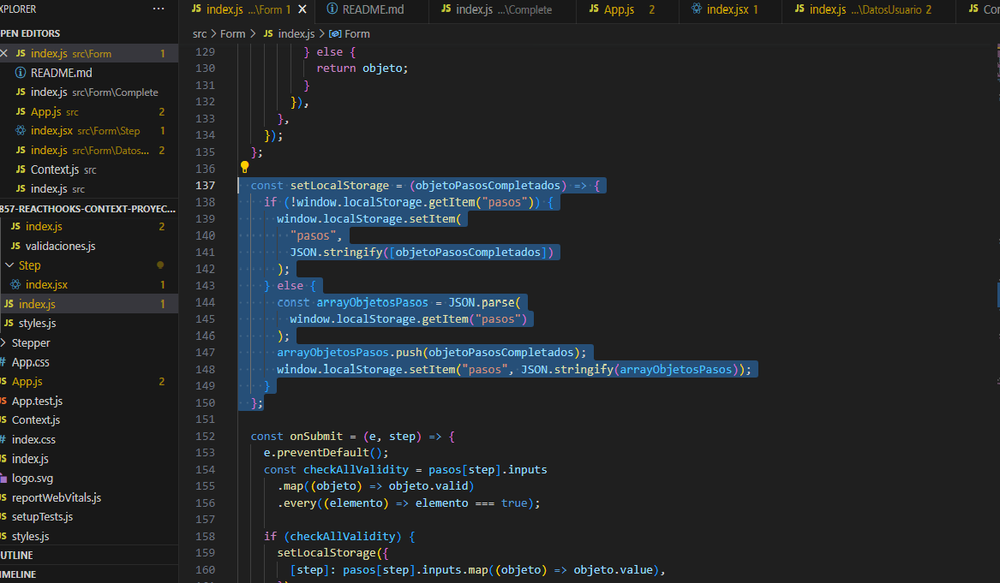
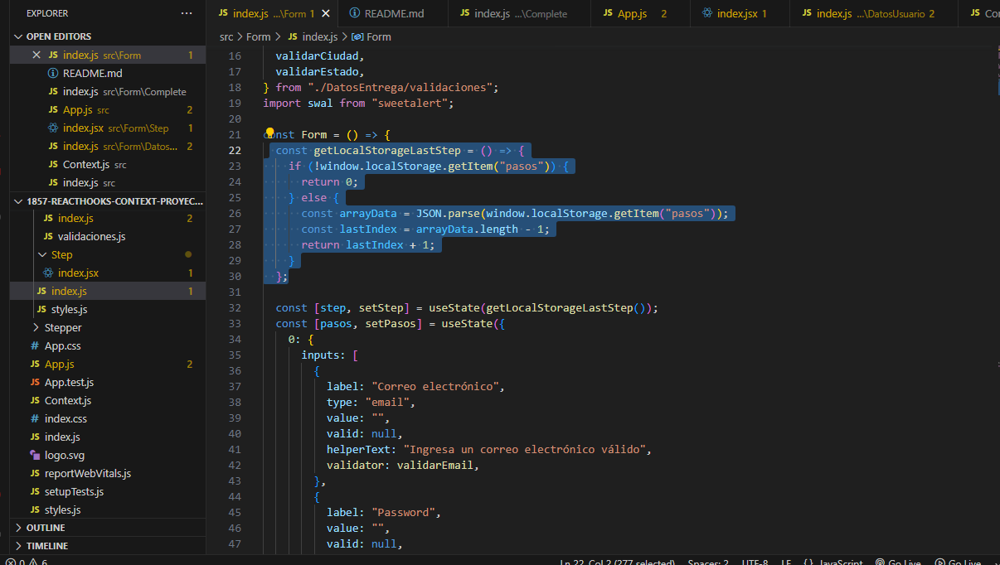
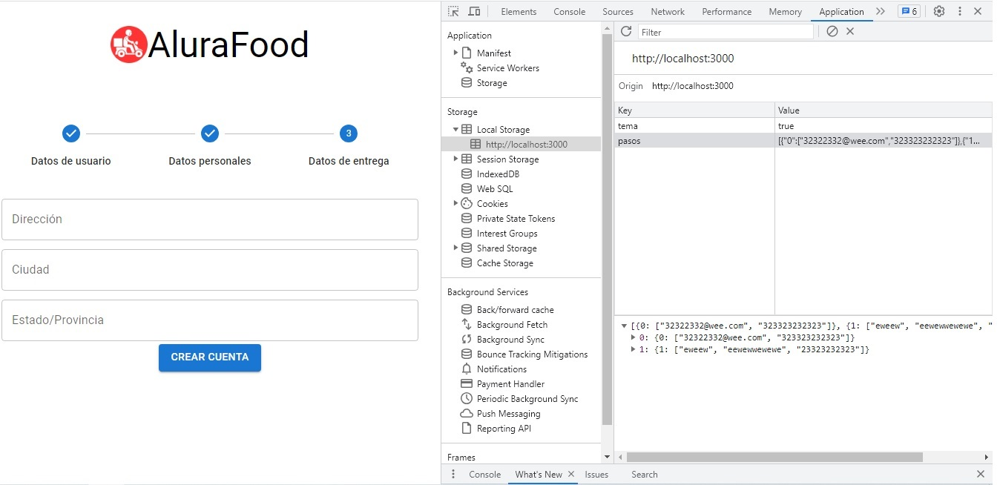

# Proyecto Finalizado Curso React: Hooks, contextos y buenas prácticas

Este repositorio contiene el código del proyecto del curso final de la formación **React G5** del programa Oracle Next Education. En el curso se realiza un proyecto el cual consiste en la manipulación de componentes de la librería Material UI dando validaciones a los campos y manejando su estado. Se implementa el componente Stepper el cual permite mostrar un orden de la secuencia de completado de cada formulario. El orden de la secuencia de llenado de formularios es: primero, se debe completar el Formulario Datos de Usuario, a continuación, se debe completar el formulario de Datos Personales y, a continuación, se debe completar el formulario de Datos de Entrega. En cada formulario se le ha dado validación a los campos cuando ocurren eventos on Change y on Blur. También he implementado en el formulario de Datos de Usuario y en el campo Contraseña la opción de mostrar o esconder la contraseña mediante varios componentes de la librería Material UI debido a que el atributo endAdornment no lo admite el componente TextField.

💡💡Además, he dado resolución al desafío dejado por el instructor el cual consiste en almacenar en el localstorage del navegador la información de registro de modo de que si se recarga la página o se cambia de pestaña, la información ya llenada en los anteriormente **formularios completados** será almacenada de modo tal de mostrar solo el formulario pendiente por llenar o el formulario final en caso de que todos los formularios de registro esten completados.

Para realizar este proyecto he debido de modificar el superobjeto creado por el instructor debido a problemas de registro de memoría de las funciones onChange y onSubmit las cuales quedaban con registro de data del "superobjeto" en base a estados previos y no en base a los re-rendereos de los componentes. Para solucionar aquel problema he establecido el superobjeto de la siguiente manera:

En la imagen anterior se observa que he eliminado de cada objeto del "superobjeto" las funciones que manejan el onChange y el onSubmit.

Para manipular ese "superobjeto" (como yo lo denomino, ya que maneja la data de todos los formularios) he creado la función set que se puede ver a continuación dentro de la función onChange:

Como se puede observar he utilizado en varias ocasiones el spread operator (...) muy útil para desempaquetar objetos.

💡💡Para realizar el desafío dejado por el instructor he creado 2 funciones que permiten "setear" un arreglo con objetos con la data de los formularios completados. La función para setear es la siguiente:

La función para obtener (get) la data del Local Storage es la siguiente:

A continuación muestro la implementación de las anteriores funciones operando:

Como dije anteriormente, he implementado la manera de mostrar u ocultar la password mediante componentes distintos al TextField de la librería Material UI y a continuación muestro a qué me refiero:

Por último, muestro screenshots de los formularios ya sea sin validar y validados:

## Formulario Datos Usuario:

### Formulario Datos Usuario Sin Validar:

### Formulario Datos Usuario Validado:

### Formulario Datos Personales Sin Validar:

### Formulario Datos Personales Validado:

### Formulario Datos Entrega Sin Validar:

### Formulario Datos Entrega Validado:

## Pantalla Final al completar todos los formularios de manera exitosa:

## Pantalla con SweetAlert al hacer click en submit pero habiendo campos faltantes por completar de manera correcta:

